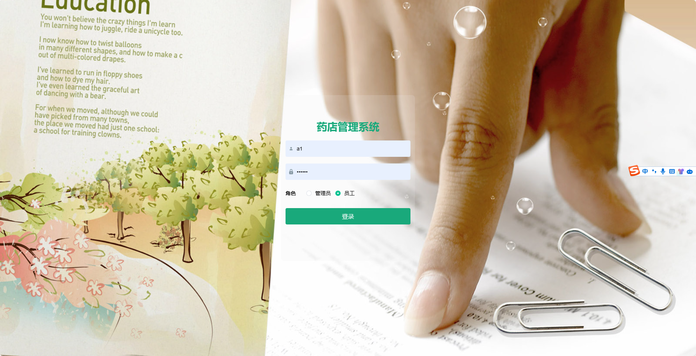

## 基于SpringBoot的药店管理系统(程序+报告)

- <b>完整代码获取地址：从戎源码网 ([https://armycodes.com/](https://armycodes.com/))</b>
- <b>技术探讨、资料分享，请加QQ群：692619798</b> 
- <b>作者微信：19941326836  QQ：952045282</b> 
- <b>承接计算机毕业设计、Java毕业设计、Python毕业设计、深度学习、机器学习</b>
- <b>选题+开题报告+任务书+程序定制+安装调试+论文+答辩ppt 一条龙服务</b>
- <b>所有选题地址 ([https://github.com/YuLin-Coder/AllProjectCatalog](https://github.com/YuLin-Coder/AllProjectCatalog)) </b>
## 项目介绍
基于SpringBoot的药店管理系统，系统包含两种角色：管理员、用户,系统分为前台和后台两大模块，主要功能如下。

### 【管理员】:
- 个人中心：管理个人信息。
- 基础数据管理：管理系统中的基础数据。
- 供应商信息管理：管理药品供应商信息。
- 药品管理：管理药品信息。
- 进货管理：管理药品进货信息。
- 销售管理：管理药品销售信息。
- 员工管理：管理员工账号信息。

### 员工：
- 个人中心：管理个人信息，包括订单记录、个人设置等。
- 供应商信息管理：管理药品供应商信息，包括添加、编辑、删除供应商等操作。
- 药品管理：管理药品信息，包括添加、编辑、删除药品等操作。
- 进货管理：管理药品进货信息，包括查看进货记录、录入进货信息等操作。
- 销售管理：管理药品销售信息，包括查看销售记录、录入销售信息等操作。

### 【前台】:
- 首页：展示药店的相关内容。
- 药品：浏览和搜索药品信息，包括药品名称、价格等。
- 个人中心：管理个人信息，包括订单记录、个人设置等。

## 项目技术
- 编程语言：Java
- 数据库：MySQL
- 项目管理工具：Maven
- 前端技术：HTML、CSS、JavaScript、Jquery、Vue
- 后端技术：Spring、SpringMVC、MyBatis

## 运行环境
- JDK版本：JDK1.8及以上
- 开发工具：IDEA、Ecplise、Myecplise都可以
- 数据库: MySQL5.7及以上
- Maven：maven3.0及以上
- Node：14.14.0及以上

## 运行截图

